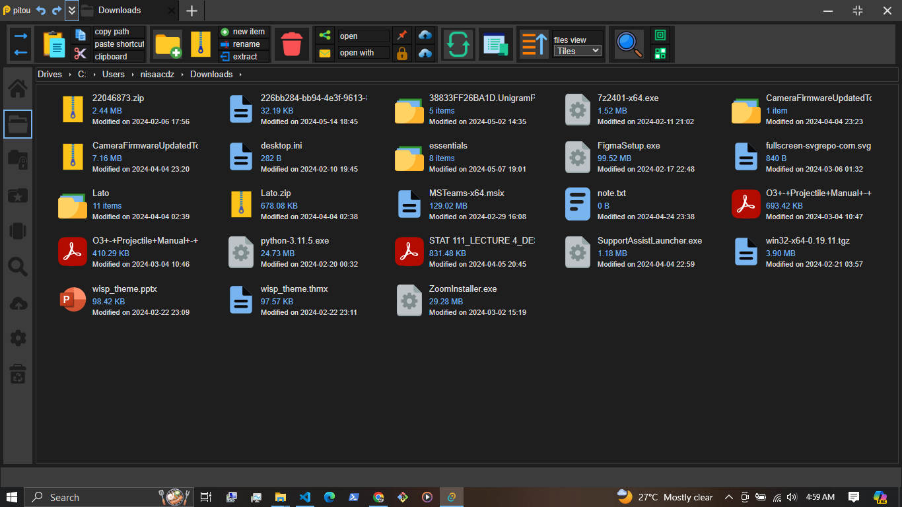

# Pitou
Pitou is a feature-rich, versatile cross-platform file explorer powered by tauri.

Frontend is created with yew.rs

## Recommended IDE Setup

[VS Code](https://code.visualstudio.com/) + [Tauri](https://marketplace.visualstudio.com/items?itemName=tauri-apps.tauri-vscode) + [rust-analyzer](https://marketplace.visualstudio.com/items?itemName=rust-lang.rust-analyzer).

## Demo

Standalone demo for windows 64bit is at: `./items/standalone_windows_64bit`

| Home menu | Explorer Menu |
|---|---|
|  |  |