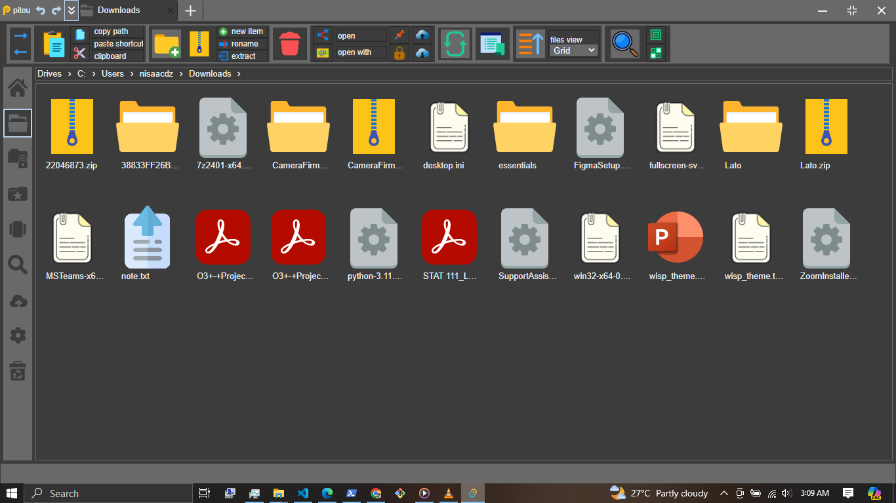

# Pitou
Pitou is a feature-rich, versatile cross-platform file explorer powered by tauri.

Frontend is created with yew.rs

## Recommended IDE Setup

[VS Code](https://code.visualstudio.com/) + [Tauri](https://marketplace.visualstudio.com/items?itemName=tauri-apps.tauri-vscode) + [rust-analyzer](https://marketplace.visualstudio.com/items?itemName=rust-lang.rust-analyzer).

## Libraries used
* tauri
* yew
* wasm-bindgen
* serde
* rustqlite
* tokio

## Reproduction

* Install rust
* Install trunk
* Install tauri-cli
* build a binary with  `cargo tauri build`

## Demo

Find a standalone demo of this app for windows 64bit at: `./items/standalone_windows_64bit`

